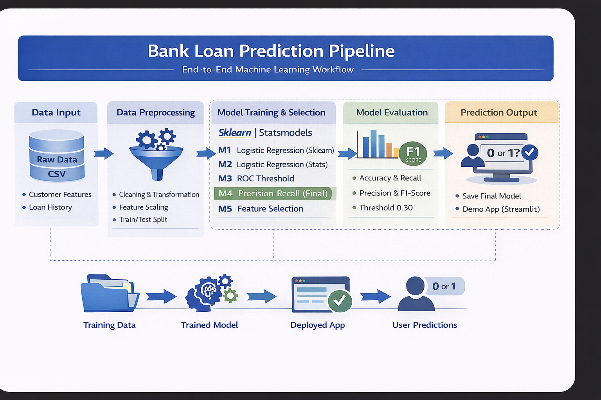

# Bank Loan Prediction

An end-to-end machine learning project for predicting whether a customer will accept a personal loan offer.

## Project overview

This repository transforms the final notebook into a cleaner GitHub portfolio project with:
- the original notebook for full experimentation
- a reproducible Python pipeline for training and inference
- comparison across **five Logistic Regression configurations**
- a lightweight demo app to show deployment readiness

## End-to-End ML Pipeline

<p align="center">
  
</p>

This diagram summarises the full workflow from raw customer data to preprocessing, model comparison, final model selection, evaluation, and deployment-style inference.

## Business problem

Banks often send personal loan offers to a broad customer base, which can increase campaign cost and reduce efficiency. The goal of this project is to identify likely responders more accurately so outreach can be more targeted and commercially useful.

## Notebook modelling story

The notebook evaluates five Logistic Regression configurations:

1. **Model 1** - Logistic Regression (Sklearn)  
2. **Model 2** - Logistic Regression (Statsmodels)  
3. **Model 3** - ROC Threshold  
4. **Model 4** - Precision-Recall (Final)  
5. **Model 5** - Feature Selection  

## Final notebook conclusion

**Model 4** performs best overall, achieving the highest test F1-score and the strongest balance between recall and precision. This repository uses that notebook-selected approach as the final deployment-ready pipeline.

## Threshold selection

The final model predicts a **probability** of loan acceptance for each customer. That probability is converted into a binary prediction using a **threshold**.

- If predicted probability is **greater than or equal to the threshold**, the model predicts `1`
- If predicted probability is **below the threshold**, the model predicts `0`

For the final selected model, the threshold is **0.30**.

This value was chosen from the **Precision-Recall vs Threshold** analysis in the notebook. The plot shows how precision increases and recall decreases as the threshold changes. A threshold of **0.30** provided the best balance between precision and recall, which also produced the strongest F1-score among the evaluated model configurations.

## Final model comparison

| Model | Threshold | Accuracy | Recall | Precision | F1-score | ROC AUC |
|---|---:|---:|---:|---:|---:|---:|
| Model 1 - Logistic Regression (Sklearn) | 0.50 | 0.6547 | 0.9931 | 0.2167 | 0.3557 | 0.9693 |
| Model 2 - Logistic Regression (Statsmodels) | 0.50 | 0.9567 | 0.6528 | 0.8624 | 0.7431 | 0.9713 |
| Model 3 - ROC Threshold | 0.089 | 0.8973 | 0.9375 | 0.4821 | 0.6368 | 0.9721 |
| Model 4 - Precision-Recall (Final) | 0.30 | 0.9573 | 0.7917 | 0.7703 | 0.7808 | 0.9721 |
| Model 5 - Feature Selection | 0.50 | 0.6653 | 0.9931 | 0.2221 | 0.3629 | 0.9289 |

### Final selected model
**Model 4** was selected as the final model because it achieved the best overall balance between recall and precision, along with the highest F1-score.

## Repository structure

```text
bank-loan-prediction/
├── README.md
├── MODEL_CARD.md
├── DEPLOYMENT.md
├── requirements.txt
├── .gitignore
├── LICENSE
├── notebooks/
│   └── bank_loan_prediction.ipynb
├── src/
│   ├── __init__.py
│   ├── config.py
│   ├── preprocess.py
│   ├── train.py
│   ├── evaluate.py
│   ├── predict.py
│   └── utils.py
├── scripts/
│   ├── __init__.py
│   ├── run_training.py
│   └── run_inference.py
├── app/
│   └── app.py
├── data/
│   ├── raw/
│   │   └── Bank_Personal_Loan_Modelling.csv
│   └── processed/
├── models/
│   ├── model_4_pr_threshold_logistic.pkl
│   ├── scaler.pkl
│   └── model_metadata.json
├── reports/
│   ├── model_comparison.csv
│   ├── final_model_metrics.csv
│   └── sample_predictions.csv
├── images/
│   ├── pipeline.png
│   ├── precision_recall_vs_threshold.png
│   ├── roc_curve.png
│   └── confusion_matrix.png
└── sample_data/
    └── sample_input.csv
```

## How to run

### 1. Create and activate a virtual environment

#### Git Bash
```bash
py -m venv .venv
source .venv/Scripts/activate
```

#### PowerShell
```powershell
py -m venv .venv
.\.venv\Scripts\Activate.ps1
```

### 2. Install requirements
```bash
pip install -r requirements.txt
```

### 3. Add the raw dataset

Place the CSV here:

```
data/raw/Bank_Personal_Loan_Modelling.csv
```

### 4. Run model comparison and final training
```bash
py -m scripts.run_training
```

This will:
- compare the 5 notebook-aligned model configurations
- save the final model artifacts in `models/`
- write metrics to `reports/`
- save plots in `images/`

### 5. Run batch inference
```bash
py -m scripts.run_inference
```

This scores the example records in `sample_data/sample_input.csv` and applies the final threshold of **0.30**.

### 6. Run the demo app
```bash
python -m streamlit run app/app.py
```

## How to test the project

### Test 1: training pipeline
Run:
```bash
py -m scripts.run_training
```

Check that these files are created:
- `reports/model_comparison.csv`
- `reports/final_model_metrics.csv`
- `models/model_4_pr_threshold_logistic.pkl`
- `models/scaler.pkl`
- `models/model_metadata.json`

### Test 2: batch prediction
Run:
```bash
py -m scripts.run_inference
```

Check that:
- predictions are printed in the terminal
- `reports/sample_predictions.csv` is created
- both `prediction_probability` and `prediction_label` appear in the output

### Test 3: deployment-style demo
Run:
```bash
python -m streamlit run app/app.py
```

Upload a CSV with the raw input columns and confirm predictions are generated without retraining.

## Inference example

The final pipeline supports scoring unseen customer records using the trained model. For each input record, the model returns:

- `prediction_probability`: likelihood of loan acceptance
- `prediction_label`: final binary prediction based on the selected threshold
- `threshold_used`: operating threshold for classification

This demonstrates that the model is not only trained and evaluated, but also ready for inference on unseen customer data.

## Why this repo is deployment-ready

This project is organised in a more production-style format:
- preprocessing is modular
- training and inference are separated
- model artifacts are saved and reloadable
- a lightweight app is included to demonstrate user-facing inference

